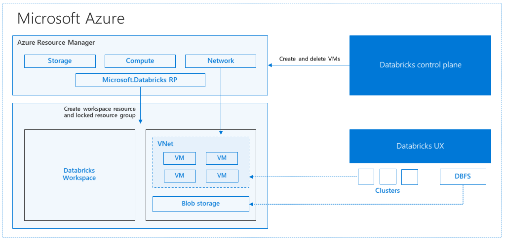

# CAF landing zones for Terraform - Databricks Cluster example

Deploys a Databrics Cluster in a virtual network, with instance pool.

DAP landing zone operates at **level 3**.

For a review of the hierarchy approach of Cloud Adoption Framework for Azure landing zones on Terraform, you can refer to [the following documentation](../../../../documentation/code_architecture/hierarchy.md).

## Prerequisites

Before running this example, please make sure you have setup your environment as described in the [following guide](../../README.md)

## Architecture diagram

This example will sit on the [prerequisites environment](../../README.md) and will allow you to deploy the following additional topology:



## Components deployed by this example

| Component          | Type of resource | Purpose                                                        |
|--------------------|------------------|----------------------------------------------------------------|
| resource group     | Resource group   | resource group to host the cluster and the node pool resources |
| databricks cluster | Workspace        | Databricks clsuter                                             |
| instance pool      | Compute          | Compute load for worker                                        |

## Deploying this example

Ensure the below is set prior to apply or destroy.

```bash
# Login the Azure subscription
rover login -t [TENANT_ID/TENANT_NAME] -s [SUBSCRIPTION_GUID]
# Environment is needed to be defined, otherwise the below LZs will land into sandpit which someone else is working on
export environment=[YOUR_ENVIRONMENT]
```

## Run Databricks landing zone deployment

```bash
# Set the folder name of this example
example=101-simple-cluster

# The Databricks construction set is banse
export base_landingzone_tfstate_name="databricks_workspace.tfstate"

# Deploy the spoke virtual network for Databricks

rover -lz /tf/caf/public/landingzones/caf_networking/ \
      -var-file /tf/caf/landingzone_data_analytics/examples/databricks/${example}/networking_spoke/networking_spoke.tfvars \
      -tfstate networking_spoke_databricks.tfstate \
      -env ${environment} \
	-level level3 \
      -a [plan|apply|destroy]
      
# Deploy Azure services for Databricks workspace
rover -lz /tf/caf/landingzone_data_analytics \
      -var-file /tf/caf/landingzone_data_analytics/examples/databricks/${example}/databricks.tfvars \
      -tfstate ${base_landingzone_tfstate_name}.tfstate \
      -env ${environment} \
	-level level3 \
      -a [plan|apply|destroy]
      
# Configure the Databricks cluster with the databricks provider
rover -lz /tf/caf/landingzone_data_analytics/add-ons/databricks \
      -var-file /tf/caf/landingzone_data_analytics/examples/databricks/${example}/databricks.tfvars \
      -tfstate databricks_cluster.tfstate \
      -var tfstate_key=${base_landingzone_tfstate_name}.tfstate \
      -env ${environment} \
	-level level3 \
      -a [plan|apply|destroy]
      
```

## Destroy an Databricks landing zone deployment

Have fun playing with the landing zone an once you are done, you can simply delete the deployment using:

```bash
# Set the folder name of this example
example=101-single-cluster

rover -lz /tf/caf/landingzone_data_analytics/databricks \
      -var-file /tf/caf/examples/databricks/${example}/databricks.tfvars \
      -tfstate ${base_landingzone_tfstate_name} \
       -env ${environment} \
       -level level3 \
       -a destroy -auto-approve
```
