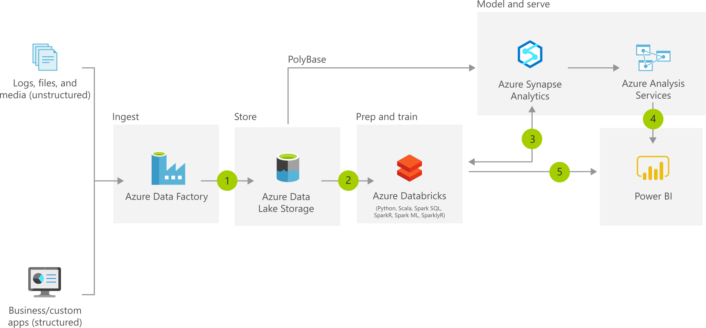

# CAF landing zones for Terraform - Databricks Cluster example

Deploys a Synapse workspace, with sparkp  pool and SQL pool in virtual network.

DAP landing zone operates at **level 3**.

For a review of the hierarchy approach of Cloud Adoption Framework for Azure landing zones on Terraform, you can refer to [the following documentation](../../../../documentation/code_architecture/hierarchy.md).

## Prerequisites

Before running this example, please make sure you have setup your environment as described in the [following guide](../../readme.md)

## Architecture diagram

This example will sit on the [prerequisites environment](../../readme.md) and will allow you to deploy the following additional topology:



## Components deployed by this example

| Component                | Type of resource                 | Purpose                                                        |
|--------------------------|----------------------------------|----------------------------------------------------------------|
| resource group           | Resource group                   | resource group to host the workspace and instance pools        |
| synapse workspace        | Workspace                        | synapse workspace                                              |
| spark pool               | compute                          | spark compute cluster                                          |
| sql pool                 | compute                          | sql compute cluster                                            |


## Deploying this example

Ensure the below is set prior to apply or destroy.

```bash
# Login the Azure subscription
rover login -t [TENANT_ID/TENANT_NAME] -s [SUBSCRIPTION_GUID]
# Environment is needed to be defined, otherwise the below LZs will land into sandpit which someone else is working on
export environment=[YOUR_ENVIRONMENT]
```

## Deploy Azure services for Synapse Workspace

```bash
# Set the folder name of this example
export example="102-synapse-workspace-pool"

rover -lz /tf/caf/landingzone_data_analytics \
      -var-file /tf/caf/landingzone_data_analytics/examples/machine_learning/${example}/configuration.tfvars \
      -tfstate machine_learning_101.tfstate \
	 -env ${environment} \
       -level level3 \
      -a [plan|apply]
```

## Destroy an DAP landing zone deployment

Have fun playing with the landing zone an once you are done, you can simply delete the deployment using:

```bash
# Set the folder name of this example
export example="102-synapse-workspace-pool"

rover -lz /tf/caf/landingzone_data_analytics \
      -var-file /tf/caf/landingzone_data_analytics/examples/machine_learning/${example}/configuration.tfvars \
      -tfstate machine_learning_101.tfstate \
	 -env ${environment} \
       -level level3 \
       -a destroy -auto-approve
```
